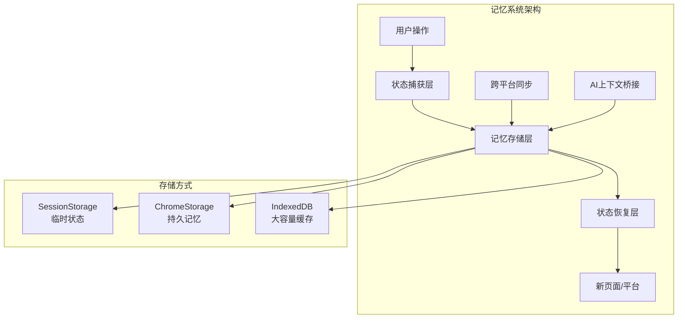
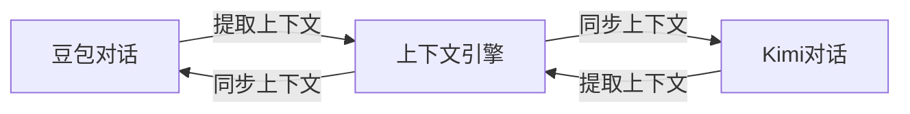

# 记忆系统功能设计

> 跨页面、跨平台的对话上下文保持与同步系统

## 💡 功能概述

记忆系统让扩展能够在用户切换不同网页、不同AI平台时，保留并同步对话上下文，提供连贯的使用体验。

---

## 🎯 核心场景

### 场景1：页面刷新不丢失状态
- 用户正在整理豆包的对话文件夹
- 不小心刷新页面
- 自动恢复：展开的文件夹、滚动位置、正在进行的操作

### 场景2：跨平台上下文延续
- 在豆包询问"如何学习Python"
- 切换到 Kimi 继续提问
- Kimi 自动知道之前的对话背景

### 场景3：工作流记忆
- 用户创建了"项目A资料"文件夹
- 在豆包收集资料，在Kimi整理总结
- 两个平台都能看到同一组相关对话

---

## 📐 系统架构



---

## 🔧 功能分层实现

### 第一层：UI 状态记忆
**实现难度：** ⭐ 低
**用户价值：** ⭐⭐⭐ 高

保持用户的界面操作状态：

| 状态类型 | 说明 | 存储方式 |
|---------|------|---------|
| 展开/折叠 | 哪些文件夹是展开的 | sessionStorage |
| 滚动位置 | 列表滚动到哪里 | sessionStorage |
| 选中项 | 当前选中的对话 | sessionStorage |
| 搜索关键词 | 正在搜索的内容 | sessionStorage |
| 打开的菜单 | 哪些下拉菜单是打开的 | sessionStorage |

**实现代码示例：**
```typescript
// 状态保存
const saveUIState = () => {
  const state = {
    expandedFolders: getExpandedFolderIds(),
    scrollTop: listRef.value?.scrollTop || 0,
    selectedConversation: selectedId.value,
    searchQuery: searchQuery.value
  }
  sessionStorage.setItem('folder-manager-state', JSON.stringify(state))
}

// 状态恢复
const restoreUIState = () => {
  const saved = sessionStorage.getItem('folder-manager-state')
  if (saved) {
    const state = JSON.parse(saved)
    expandedFolderIds.value = state.expandedFolders || []
    searchQuery.value = state.searchQuery || ''
    // 恢复滚动位置需要延迟执行
    setTimeout(() => {
      listRef.value?.scrollTo(0, state.scrollTop || 0)
    }, 100)
  }
}
```

---

### 第二层：跨页面会话同步
**实现难度：** ⭐⭐ 中
**用户价值：** ⭐⭐⭐ 高

多个标签页之间实时同步操作：

**功能特性：**
- 在 Tab A 创建文件夹，Tab B 自动显示
- 在 Tab A 移动对话，Tab B 同步更新
- 在 Tab A 删除对话，Tab B 移除该项

**实现方式：**
```typescript
// 使用 BroadcastChannel API 实现跨标签页通信
const channel = new BroadcastChannel('ai-chat-sync')

// 发送变更
const broadcastChange = (type: string, data: any) => {
  channel.postMessage({ type, data, timestamp: Date.now() })
}

// 监听变更
channel.onmessage = (event) => {
  const { type, data } = event.data
  switch (type) {
    case 'folder-created':
      handleRemoteFolderCreate(data)
      break
    case 'conversation-moved':
      handleRemoteConversationMove(data)
      break
    case 'folder-deleted':
      handleRemoteFolderDelete(data)
      break
  }
}
```

**冲突处理策略：**
- 时间戳优先：后发生的操作覆盖先发生的
- 用户确认：重要操作需要弹窗确认
- 合并策略：非冲突操作自动合并

---

### 第三层：跨平台上下文桥接
**实现难度：** ⭐⭐⭐ 高
**用户价值：** ⭐⭐⭐⭐ 极高

在不同AI平台之间共享对话上下文：

**实现思路：**



**核心功能：**

1. **话题关联**
   - 自动识别相关话题的对话
   - 在 Kimi 查看"Python学习"话题时，显示豆包的相关对话

2. **上下文提示**
   - 切换到新平台时，显示最近相关对话的摘要
   - "您之前在豆包询问过Python学习，要继续这个话题吗？"

3. **统一工作区**
   - 创建跨平台的"项目文件夹"
   - 把豆包和Kimi的相关对话放在同一个逻辑分组

**技术实现：**
```typescript
// 上下文关联类型
interface ContextLink {
  id: string
  topic: string           // 话题关键词
  platform: 'doubao' | 'kimi'
  conversationId: string
  conversationTitle: string
  summary: string         // AI生成的摘要
  relatedLinks: string[]  // 关联的其他平台对话ID
  lastActive: number
}

// 上下文存储
const contextStore = {
  // 保存对话上下文
  async saveContext(platform: string, conversation: Conversation) {
    const summary = await generateSummary(conversation)
    const context: ContextLink = {
      id: generateId(),
      topic: extractTopic(summary),
      platform,
      conversationId: conversation.id,
      conversationTitle: conversation.title,
      summary,
      relatedLinks: [],
      lastActive: Date.now()
    }
    // 查找相关上下文并建立关联
    const related = await findRelatedContexts(context.topic)
    context.relatedLinks = related.map(r => r.id)
    await saveToStorage(context)
  },
  
  // 获取当前平台的相关上下文
  async getRelatedContexts(currentPlatform: string, topic?: string) {
    const allContexts = await getAllContexts()
    return allContexts.filter(ctx => {
      // 获取其他平台的上下文
      if (ctx.platform === currentPlatform) return false
      // 如果有指定话题，按话题过滤
      if (topic && !ctx.topic.includes(topic)) return false
      return true
    }).slice(0, 5) // 最多显示5个
  }
}
```

---

### 第四层：智能记忆助手
**实现难度：** ⭐⭐⭐⭐ 很高
**用户价值：** ⭐⭐⭐⭐⭐ 极高

主动帮助用户管理和利用历史对话：

**功能特性：**

1. **记忆提醒**
   - "3天前您在豆包询问过这个问题，要查看答案吗？"
   - "您收藏的对话已经超过30天未查看，建议归档"

2. **知识图谱**
   - 自动构建用户的知识图谱
   - 显示话题之间的关联关系
   - 发现知识盲区

3. **智能建议**
   - "您经常询问Python相关问题，建议创建一个专门文件夹"
   - "这个对话和您之前收藏的某篇内容相关，要关联吗？"

---

## 📊 记忆系统数据流

```
用户操作
    ↓
[状态捕获] ──→ SessionStorage（临时状态）
    ↓
[重要性判断]
    ↓
   ├─→ 高 ──→ ChromeStorage（持久记忆）
   │
   └─→ 低 ──→ 过期清理
    ↓
[跨平台同步] ──→ BroadcastChannel
    ↓
[AI分析] ──→ 生成摘要、提取话题、建立关联
    ↓
[记忆存储] ──→ IndexedDB（大规模数据）
    ↓
新页面加载
    ↓
[记忆恢复] ←── 按优先级恢复状态
    ↓
[上下文注入] ←── 显示相关历史
```

---

## 🎨 UI 设计建议

### 记忆状态指示器
在扩展图标或界面角落显示记忆状态：
```
🧠 记忆已同步    - 绿色，表示跨平台同步正常
🧠 记忆待同步    - 黄色，有未同步的变更
🧠 记忆冲突      - 红色，需要用户处理
```

### 上下文切换面板
当检测到用户切换话题或平台时，显示浮层：
```
┌─────────────────────────────────┐
│ 💡 发现相关对话                    │
├─────────────────────────────────┤
│ 您在 Kimi 也有关于"Python"的对话：  │
│ • Python 进阶学习路线（2天前）     │
│ • Python 项目实战技巧（5天前）     │
│                                 │
│ [查看全部] [忽略]                 │
└─────────────────────────────────┘
```

### 记忆时间线
新增一个"记忆"视图，按时间展示跨平台活动：
```
今天
  ├─ 14:30 在 Kimi 创建了"项目A"文件夹
  └─ 10:15 在豆包收藏了3个对话

昨天
  ├─ 18:20 在 Kimi 整理了"学习资料"
  └─ 09:00 在豆包搜索了"Python"
```

---

## ⚡ 性能优化

1. **增量同步**：只传输变更的数据，不是全量同步
2. **延迟加载**：非关键记忆数据延迟加载
3. **本地缓存**：频繁访问的数据缓存到内存
4. **过期清理**：自动清理30天前的临时状态

---

## 🔒 隐私考虑

1. **用户控制**：可以关闭记忆功能或清理记忆
2. **敏感标记**：标记包含敏感信息的对话不进入记忆系统
3. **本地优先**：所有记忆数据优先存储在本地
4. **加密选项**：提供记忆数据加密选项

---

## 📋 实现优先级

| 层级 | 功能 | 难度 | 建议顺序 |
|------|------|------|----------|
| 第一层 | UI 状态记忆 | ⭐ 低 | Phase 1 |
| 第二层 | 跨页面会话同步 | ⭐⭐ 中 | Phase 2 |
| 第三层 | 跨平台上下文桥接 | ⭐⭐⭐ 高 | Phase 3 |
| 第四层 | 智能记忆助手 | ⭐⭐⭐⭐ 很高 | Phase 4 |

---

## 💭 总结

记忆系统是一个**渐进式功能**：
- **基础版**（第一层）解决"刷新页面不丢失状态"的痛点
- **进阶版**（第二、三层）实现"多标签页、多平台无缝切换"
- **高级版**（第四层）提供"AI主动帮助管理知识"的智能体验

建议从第一层开始实现，逐步迭代，每个阶段都能给用户带来实际价值。

---

*文档生成时间：2026-03-08*
*功能设计：跨平台记忆系统*
